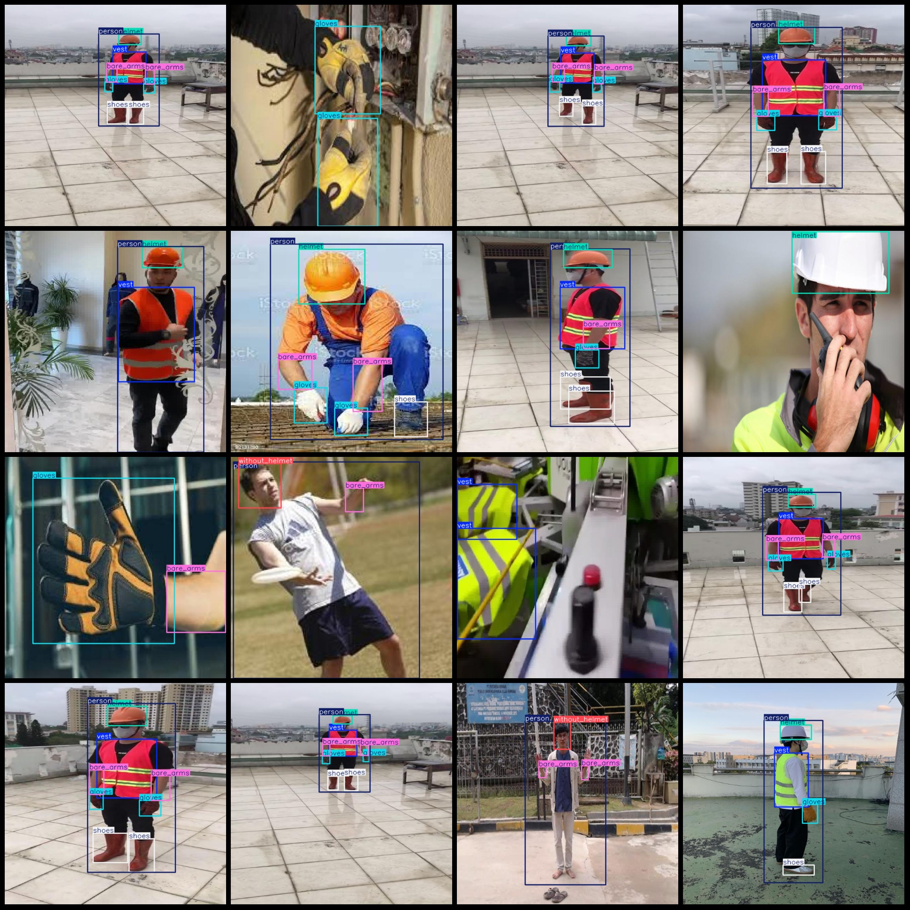
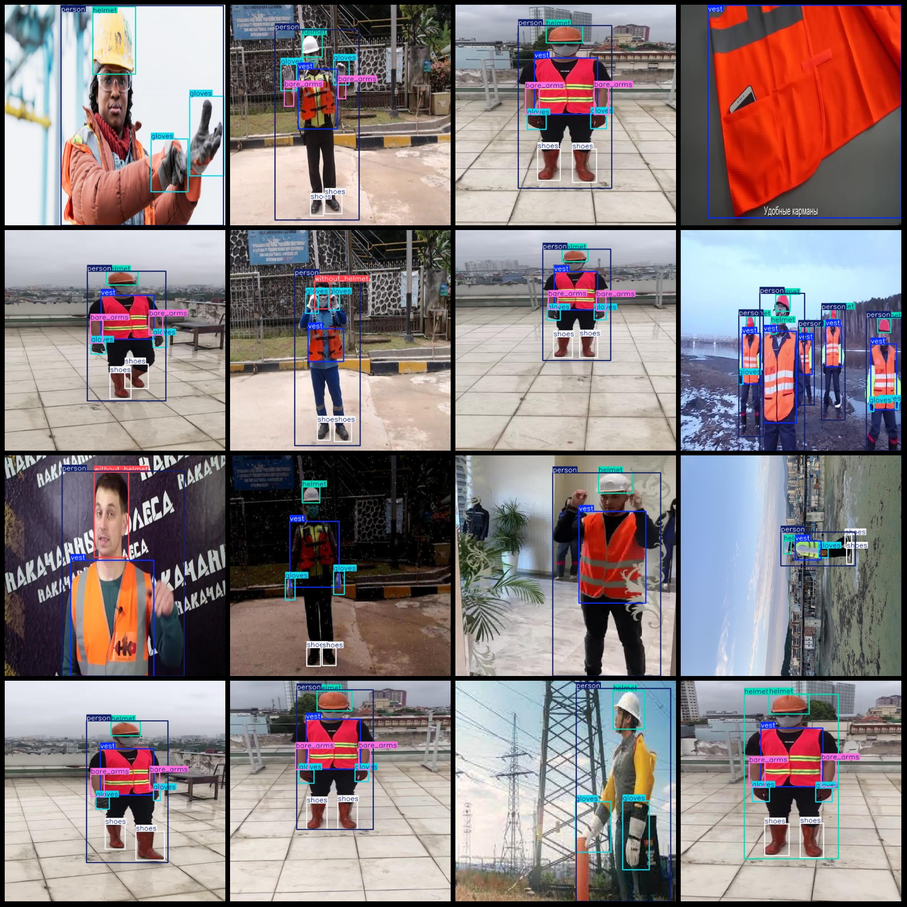

# Smart Construction Workers Safety Helmet, Garment Protection Gloves, Boots Detection Data Set in VOC+YOLO Format

Dataset Format: Pascal VOC format + YOLO format (excluding split paths in txt files, only containing jpg images and corresponding VOC format xml files and yolo format txt files)
Number of Images (jpg files): 1427
Number of Annotated Files (xml files): 1427
Number of Annotated Files (txt files): 1427
Number of Annotated Categories: 7
Label names for annotating categories according to the order in the labels folder's classes.txt file: ["bare_arms", "gloves", "helmet", "person", "shoes", "vest", "without_helmet"]
Number of bounding boxes per category:
- bare_arms (bare arms) = 1572, occupying images = 821
- gloves (gloves) = 1866, occupying images = 994
- helmet (helmet) = 1399, occupying images = 1053
- person (person) = 1682, occupying images = 1213
- shoes (shoes) = 1786, occupying images = 863
- vest (vest) = 1689, occupying images = 1234
- without_helmet (without helmet) = 357, occupying images = 209
Total bounding boxes: 10351
Image resolution: 640x640
Annotation tool used: labelImg
Annotation rule: draw a rectangle around the category
Important note: The dataset does not have any partitioned training/validation/test sets. Please partition it yourself.
Special statement: This dataset does not guarantee the accuracy of the trained models or weight files.
Image preview:

## Images

Here is a pay link on Stripe ( https://buy.stripe.com/3cs8yP7sY87d0vu9AB ). Please contact me lonlonago@foxmail.com after funding $89, and I will send you a complete data files , thank you!

